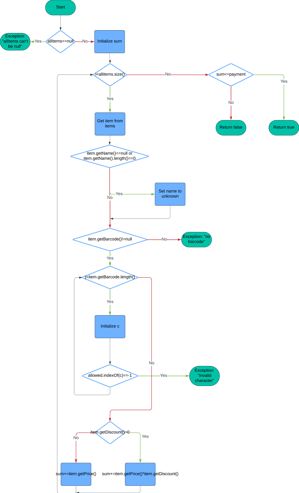

# SI_2024_lab2_226027
Александар Димиќ 226027
# 2.

# 3.
Цикломатската комплексност се пресметува со формулата: E - N + 2P, каде Е е бројот на ребра, N е бројот на темиња и P е бројот на региони.
Во мојот граф има 24 ребра, 20 темиња и еден регион, и како резултат се добива цикломатска комплексност од 6, што значи дека постојат 6 линеарно независни патишта.
# 4.
1. Празна allItems листа

    input: allItems = null, payment = 200
    
    output: RuntimeException ("allItems list can't be null!")

2. Продукт без име

    input: allItems = {("", "123", 100), (null, "123", 100)}, payment = 100 

    output: name is set to unknown

3. Продукт без баркод

    input: allItems = {("blah", null, 100), ("blah", "", 100)}, payment = 100

    output: RuntimeException("No barcode!")

4. Баркод со невалиден карактер

    input: allItems = {("blah", "abc", 100)}, payment = 100

    output: RuntimeException("Invalid character in item barcode!")

5. Продукт со попуст

    input: allItems = {("item1", "123", 100, 0.15)} , payment = 500

    output: sum = 15

6. Продукт без попуст

    input: allItems = {("item1", "123", 100, 0)} , payment = 500

    output: sum = 100

7. Продукт со попуст, цена поголема од 300 и баркод кој почнува на 0:

    input: allItems = {("item1", "0123", 400, 0.5)}, payment = 300

    output: sum = 170; 200 - 30

8. Сумата на сите продукти е помала еднаква од уплатата

    input: allItems = {("item1", "0123", 400, 0.5)}, payment = 300

    output: sum = 170, payment = 300; return true

9. Сумата на продуктите е моголема од уплатата

    input: allItems = {("item1", "0123", 400, 0.5)}, payment = 150

    output: sum = 170; payment = 150; return false

# 5.
1) Сите услови се точни

    Input: item = new Item("item1", "0123", 400, 0.1)

    Output: sum е намалена за 30

2) price > 300 е неточно, discount > 0 е точно, barcode starts with '0' е точно

    Input: item = new Item("item1", "0123", 200, 0.1f)

    Output: sum не е намалена

3) price > 300 е точно, discount > 0 е неточно, barcode starts with '0' е точно

    Input: item = new Item("item1", "0123", 400, 0f)

    Output: sum не е намалена

4) price > 300 е точно, discount > 0 е точно, barcode starts with '0' е неточно

    Input: item = new Item("item1", "1123", 400, 0.1f)

    Output: sum не е намалена

5) price > 300 е неточно, discount > 0 е неточно, barcode starts with '0' е точно

    Input: item = new Item("item1", "0123", 200, 0f)

    Output: sum не е намалена

6) price > 300 е точно, discount > 0 е неточно, barcode starts with '0' е неточно

    Input: item = new Item("item1", "1123", 400, 0f)

    Output: sum is not reduced

7) price > 300 е неточно, discount > 0 е точно, barcode starts with '0' е неточно

    Input: item = new Item("item1", "1123", 200, 0.1f)

    Output: sum не е намалена

8) Сите услови се неточни

    Input: item = new Item("item1", "1123", 200, 0f)

    Output: sum не е намалена